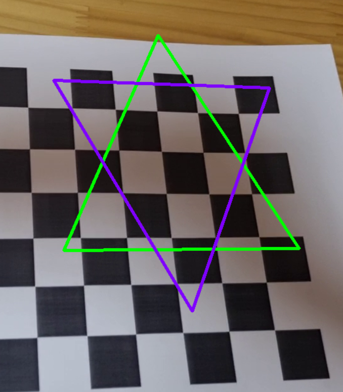
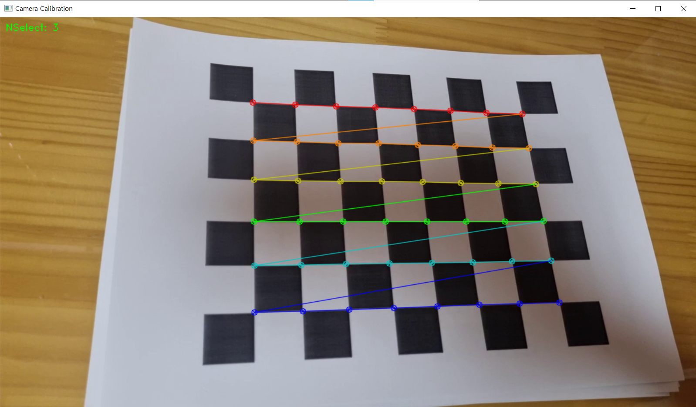
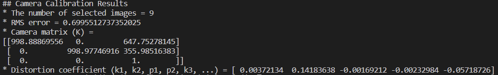

# mini_AR_magicalzone
this is mini_AR_magicalzone, you can view your magical icon likes AR on recoreded video

    
체스판(체커보드) 위에 표시되는 마법진(?)을 보세요!   
     
   
이 미니 마법진 프로그램으로 이미 만들어진 파일과 직접 캘리브레이션을 하고 자신의 체스판으로 테스트할 수 있습니다.   
    

## 1. 이미 만들어진 파일 실행해보기  :bear:   
- ***camera_calibaration.py*** 실행   :***[코드 원본-mintlab](https://github.com/mint-lab/cv_tutorial/blob/master/examples/pose_estimation_chessboard.py)***     
   
초록색과 보라색으로 된 마법진 문양이 체스보드 위에 표시되는 것을 확인할 수 있습니다.   
  
## 2. 직접 카메라 캘리브레이션+파일 실행해보기  :cat:
1) ***mini_AR_gallery.py***를 실행  :
***[코드 원본-mintlab](https://github.com/mint-lab/cv_tutorial/blob/master/examples/camera_calibration.py)***   
   
자신의 카메라로 체스보드를 촬영하세요. -카메라의 초점에 대한 정보(5개의 파라미터)를 얻기 위함. (갤럭시는 화면을 길게 누르면 초점이 고정됨)   
촬영한 데이터를 코드가 찾아갈 수 있도록 한 후,   **space bar**, **enter**를 눌러 카메라에 대한 정보를 얻을 수 있게 하세요.   
잘 출력되면 다음과 같이 결과값이 출력됩니다. (저의 카메라 출력값입니다.)   
   
-->K = np.array([[998.88869556,   0.        , 647.75278145],   
                 [0.         ,  998.97746916, 355.98516383],   
                 [0.         ,  0.          , 1.          ]])   
   dist_coeff = np.array([0.00372134,  0.14183638, -0.00169212, -0.00232984, -0.05718726])
    
2) ***camera_cailbration.py***를 실행  :   
앞의 과정에서 얻은 카메라의 정보를 다음과 같이 코드에 입력을 합니다.   
영상을 플레이하여 자신이 촬영한 체스보드(체커보드) 위에서 마법진이 그려지는 것을 확인하세요!     

:smiley: [유튜브를 통해서 작동 전체 영상보기](https://youtu.be/PMAax5oQRrU)   
   